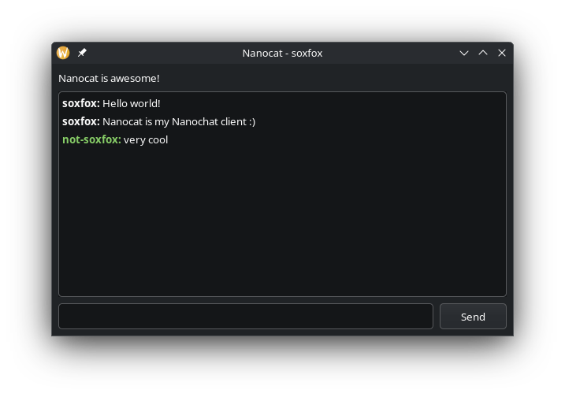

# Nanocat

It's a [Nanochat](https://git.phial.org/d6/nanochat) client!

## Running

1. [Install uv](https://docs.astral.sh/uv/getting-started/installation/)
2. `git clone https://codeberg.org/soxfox42/nanocat.git`
3. `cd nanocat`
4. `uv run main.py`
  1. If you want to connect to a server other than the default (`vein.plastic-idolatry.com`), just pass it as an argument: `uv run main.py pesterchum.soxfox.me`.
